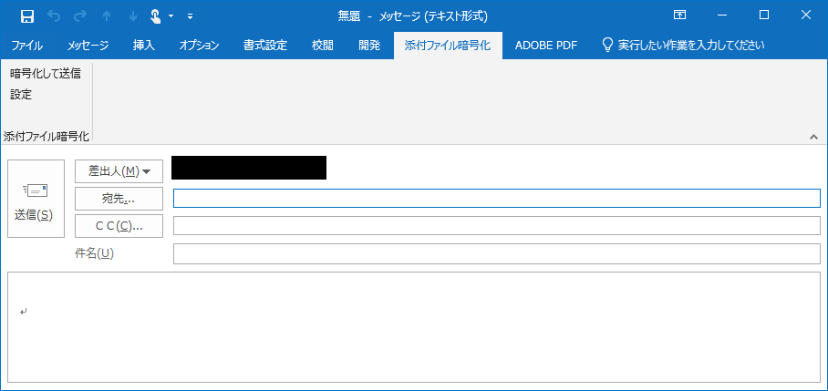
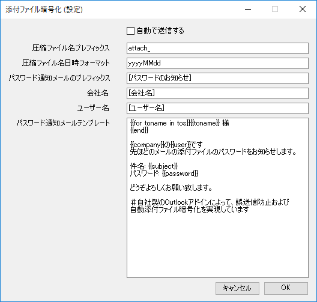
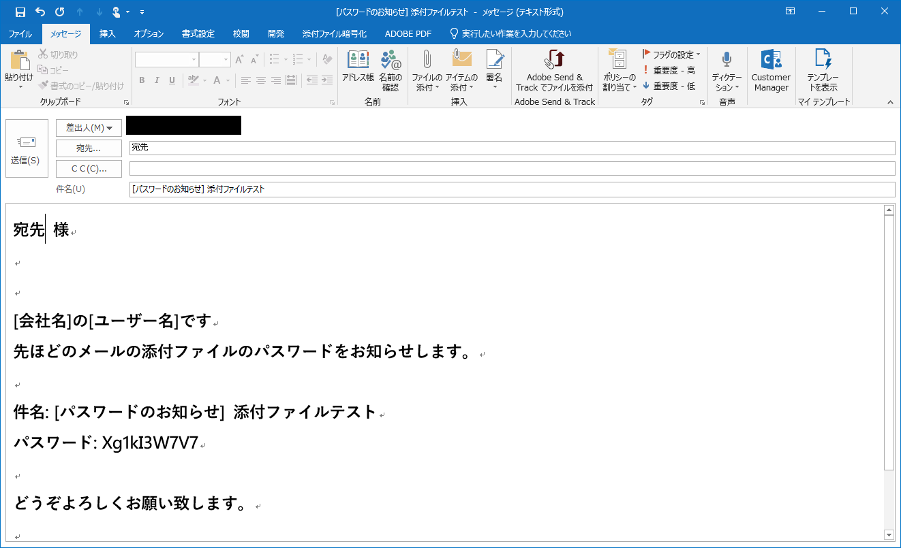
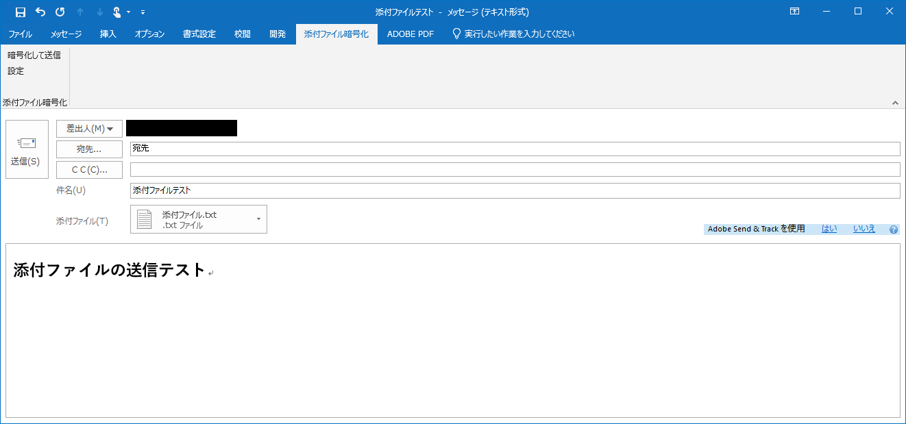

# Outlook自動化 「パスワードは別途」 ツール

本ツールは「パスワードは別途お知らせします」を自動化する、
Outlook 2013, 2016用のVSTOアドインです。


**「パスワードは別途」の有効性を示す意図、推奨する意図はありません、**

## 機能

* メール添付ファイルをパスワード付きZIPファイルに変換
* パスワード通知用メールの作成


## インストール方法

git clone して下さい。

```bat
git clone https://github.com/mm0205/password-betto.git
```

「AttachmentEncryption.sln」(Visual Studio 2017 のソリューションファイル)を
開いて、Visual Studioでビルド、発行を行って下さい。

## 依存するパッケージ

本ツールは下記のパッケージに依存します。
ライセンスに関しては、各パッケージのURLからライセンス表記をご確認下さい。

* lunet-io/scriban

 [https://github.com/lunet-io/scriban](https://github.com/lunet-io/scriban)

* icsharpcode/SharpZipLib

 [https://github.com/icsharpcode/SharpZipLib](https://github.com/icsharpcode/SharpZipLib)

## 本ツールのライセンス

MITライセンスです。

## 使い方

本ツールをインストールすると、Outlookのメール編集画面のリボンに
下記のタブが追加されます。



### 設定

設定ボタンをクリックすると、設定画面が表示されます。



### 暗号化して送信

暗号化して送信ボタンをクリックすると、下記の順に自動で処理が行われます。

1. 添付ファイルをパスワード付きZIPファイルに変換
1. パスワード通知メールを作成
1. 元のメールを送信
1. パスワード通知メールを送信

設定画面で「自動で送信する」のチェックを外した場合、

* 添付ファイルのパスワード付きZIPファイル化
* パスワード通知メールの作成

までを自動で行います。





### 注意

* 添付ファイルに同じ名前のファイルが複数ある場合、ZIP化処理は失敗します
* 元の添付ファイルがZIPファイル1つだけの場合、同名のパスワード付きZIPファイルが作成されます
* 元の添付ファイルがパスワード付きZIPファイルである場合、ZIP化処理は失敗します

* 「暗号化して送信ボタン」をクリックする前に、

1. TO/CC/BCCのいずれかに一つ以上の(有効な)送信先を入力して下さい
1. 件名を入力して下さい
1. 添付ファイルを1つ以上指定して下さい




